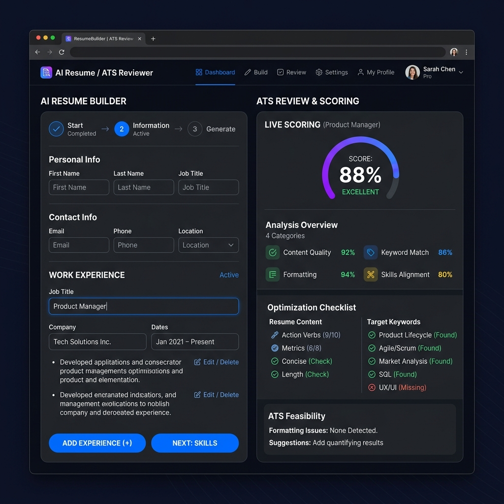
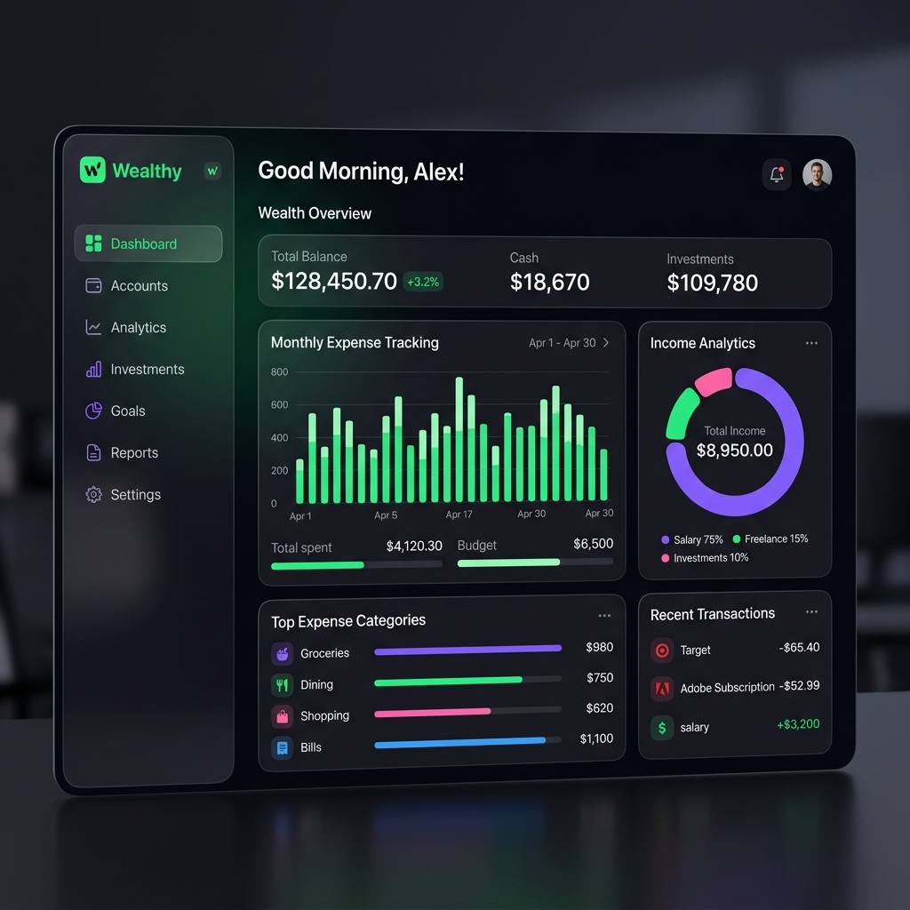
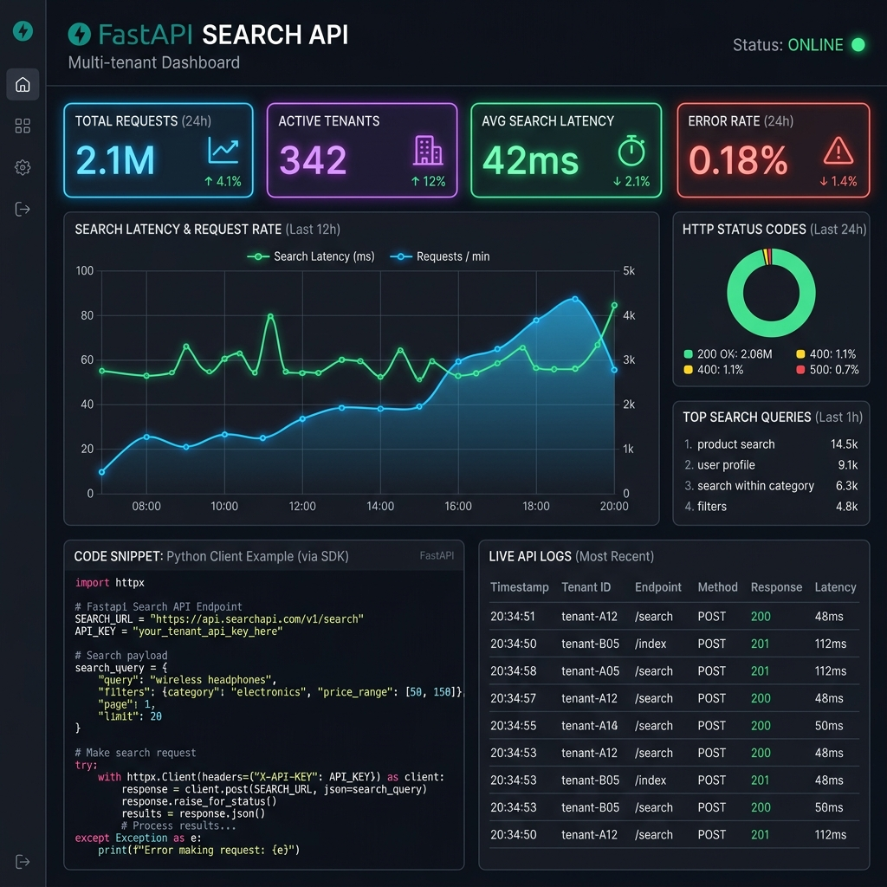
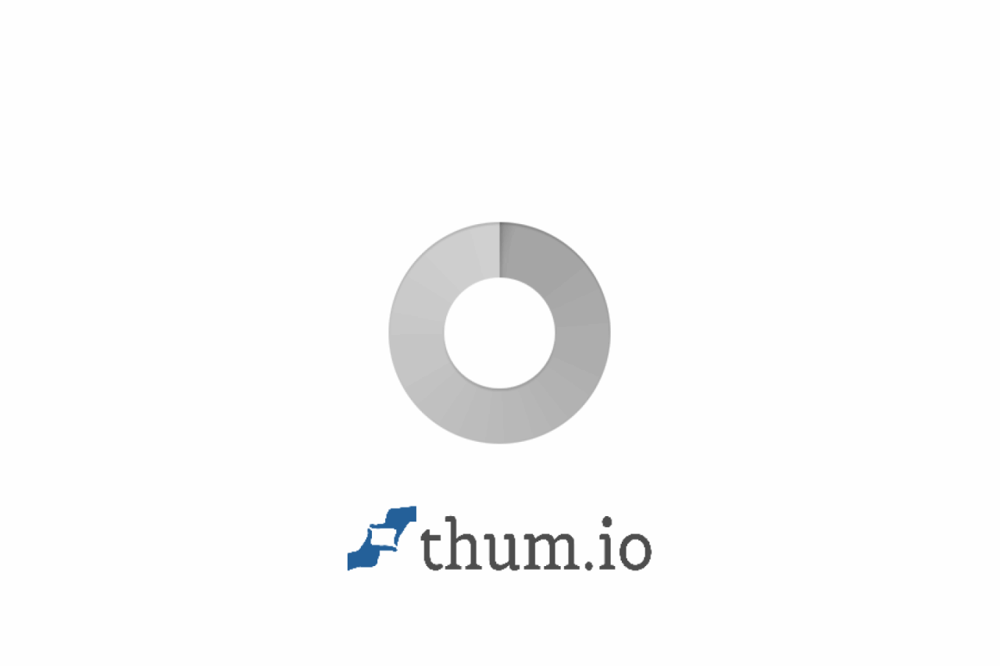

# Gowtham Raju - Projects Portfolio 🚀

Welcome to my project portfolio repository! Here, you'll find a curated list of my recent full-stack, AI, and backend projects.

---

## 🧠 AI Resume Builder & ATS Reviewer

### Overview
This is a full-stack web application designed to assist job seekers by generating professional, ATS-compliant resumes and analyzing existing PDF resumes against specific job descriptions. The application uses Flask (Python) for the backend API and the Gemini API for all generative and analytical tasks.

[**Live Demo**](https://app.netlify.com/projects/resumeart/overview) | [**GitHub Repository**](https://github.com/Gowtham5753/resume-ai.git)

### Features
*   **Two-Column UI:** Separates the Generation feature from the ATS Review feature for a clean user experience.
*   **Resume Generation:** Creates a new resume based on user input, strictly following a quantifiable, Software Engineer ATS format.
*   **ATS Resume Review:** Allows users to upload an existing PDF resume and paste a job description (JD) to receive a detailed compatibility report, including a score and suggestions.
*   **Secure Deployment:** Utilizes the `.env` file for API key protection.
*   **PDF Output:** Generates the final output (resume or review report) as a professional PDF file.

---

## ⚖️ RightLaw AI - Indian Legal Intelligence

### Overview
RightLaw AI is a sophisticated, multilingual legal assistant designed specifically for the Indian Legal System. It leverages Google's Gemini Pro models to simplify complex legal jargon, analyze court judgments (IPC/BNS/Constitution), and provide real-time legal grounding.

### Features
*   **Judgment Analysis:** Upload Indian court judgments for a simplified breakdown of facts, laws involved, and verdicts.
*   **Legal Chat:** Converse with an AI expert on IPC sections, Constitutional Articles, and the new BNS framework.
*   **Grounded Law Search:** Real-time legal news and case law summaries powered by Google Search grounding.
*   **Daily Laws:** Bite-sized insights into common laws (Traffic, Property, Cyber) for everyday citizens.
*   **Multilingual Support:** Full support for English, Hindi (हिन्दी), and Telugu (తెలుగు).

**Tech Stack:** React (ESM), Tailwind CSS, Google Gemini 3 Pro & 2.5 Flash, IndexedDB.

---

## 💰 Wealthy - Expense & Income Tracking

### Overview
Wealthy is a modern web application designed to help users manage, track, and analyze their financial activities in one place. It provides an intuitive interface and powerful features to simplify personal and business financial management.

### Features
*   **Expense & Income Tracking**
*   **Financial Insights & Analytics**
*   **Secure Data Handling**
*   **Responsive UI for all devices**
*   **Smart organization of financial data**

**Tech Stack:** React + Vite, Node.js / TypeScript, Tailwind CSS.

---

## 🍽️ Restaurant Menu Web App

### Overview
A full-stack Restaurant Menu Application that dynamically displays menu items from a SQLite database using a custom Express backend API.

[**GitHub Repository**](https://github.com/Gowtham5753/Restaurant.git)

### Features
*   **Dynamic menu rendering** from the database.
*   **Categorized food items** (e.g., Indian dishes).
*   **Fast frontend** using Vite + React.
*   **Clean project structure** and backend API integration.

**Tech Stack:** React, TypeScript, Vite, Node.js, Express.js, SQLite.

---

## 🌐 Portfolio Generator

### Overview
The Portfolio Generator is a modern, responsive, and easily customizable template designed to help developers and designers quickly launch a professional online portfolio. It provides a clean, fast foundation for showcasing skills, projects, and contact information.

[**GitHub Repository**](https://github.com/Gowtham5753/portfolio-generator.git)

**Tech Stack:** React, Vite, Tailwind CSS, Netlify.

---

## 🔍 FastAPI Multi-tenant Search API

### Overview
This is a production-ready FastAPI application that provides a multi-tenant search API. The application is built with a focus on clean architecture, efficient data handling, and robust error management.

### Features
*   **Multi-tenant Support:** Data is isolated by tenant, ensuring that each client can only access their own information.
*   **Search Functionality:** Efficiently search for documents based on a keyword.
*   **Interactive API Documentation:** Automatically generates a live, interactive API documentation (Swagger UI) at `/docs`.

**Tech Stack:** Python 3.11, FastAPI, SQLAlchemy, SQLite.

---

## ⚡ FastAPI Rate Limiter with Real-time Sync

### Overview
A production-ready FastAPI rate limiter featuring multiple algorithms, real-time monitoring, and synchronization capabilities. Built with Python, SQLite, and modern web technologies.

### Features
*   **Multiple Rate Limiting Algorithms:** Sliding Window, Fixed Window, Token Bucket.
*   **Real-time Monitoring:** WebSocket connections, Server-Sent Events (SSE) support, interactive web dashboard.
*   **Flexible Configuration:** Per-endpoint rate limiting, dynamic updates, RESTful admin API.

**Tech Stack:** Python 3.8+, FastAPI, SQLAlchemy (async), SQLite, WebSockets.

---

## 🧾🤖 AI Invoice Analyzer

### Overview
A smart AI-powered web app that summarizes invoice files using Google Gemini.

[**GitHub Repository**](https://github.com/Ganesh-s-g-v/ai-invoice-analyzer.git)

### Features
*   Upload any PDF or image invoice.
*   Uses OCR and Gemini AI to read and summarize: Invoice number, Company name, Purpose of invoice, Date, and total amount.

**Tech Stack:** Python + Flask, Tesseract OCR, Google Gemini API.

---

## 💹 Financial AI Guide

### Overview
An intelligent, modern web-based financial assistant designed to provide stock analysis, market trends, company insights, and financial guidance through an interactive AI-powered chat interface. Built with a sleek dark-mode dashboard, responsive UI, markdown-rendered conversations, and real-time backend integration for financial analysis.

### Features
*   **AI-Powered Financial Assistance:** Stock price analysis, market trends, company performance metrics, and financial Q&A.
*   **Modern User Interface:** Elegant dark mode by default, responsive Tailwind CSS design, animated indicators.
*   **Smart Chat Experience:** Real-time API integration, Markdown rendering (`marked.js`), and syntax highlighting (`highlight.js`).

**Tech Stack:** HTML5, Tailwind CSS, Vanilla JS, Flask / Node / FastAPI compatible.

---

## 👨‍💻 Author
**Gowtham Raju**
*   [GitHub (@Gowtham5753)](https://github.com/Gowtham5753)
*   [LinkedIn](https://www.linkedin.com/in/thokala-gowtham-raju-4a2842300)
